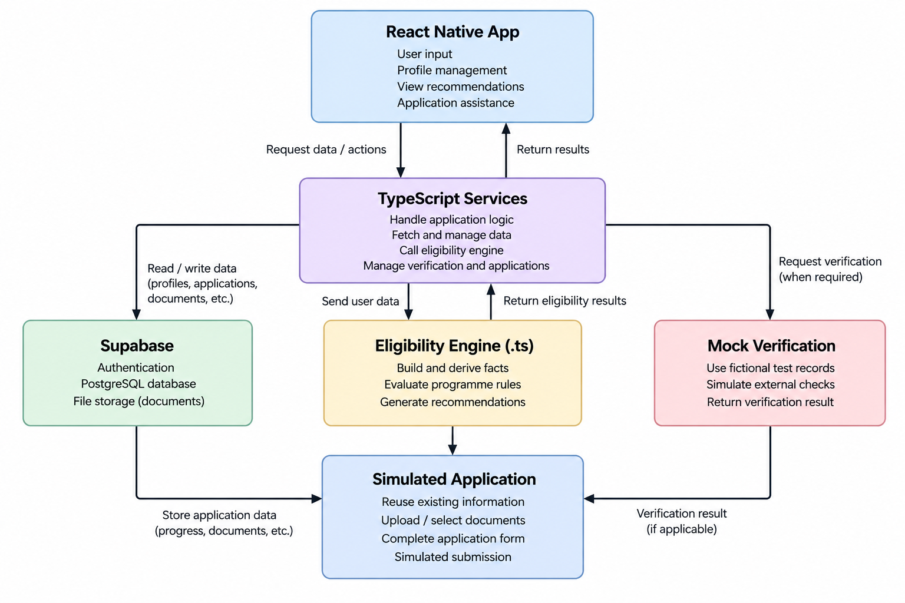

# BantuanKu System Architecture

BantuanKu uses a mobile-based architecture that separates the user interface, application services, data storage, 
eligibility processing, mock verification and simulated application workflow.

## Architecture
The **React Native application** provides the user interface while **TypeScript services** handle application logic and
communication between system components.

**Supabase** provides authentication, PostgreSQL database storage and private file storage for persistent user and 
application data.

The **Eligibility Engine** evaluates beneficiary information against the predefined rules for the supported government 
aid programs. Required data is retrieved once, transformed into eligibility facts and evaluated locally in TypeScript to
reduce unnecessary database requests.

**Mock Verification** uses fictional test records to simulate selected external verification processes where required.

The **Simulated Application** reuses existing profile information and supporting documents where applicable. Application
progress is stored in Supabase, but no application is submitted to an actual government agency.

> BantuanKu provides preliminary eligibility recommendations and simulated application assistance only. It does not 
determine official eligibility, access actual government databases or perform actual government application submission.
